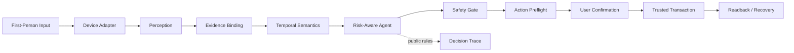
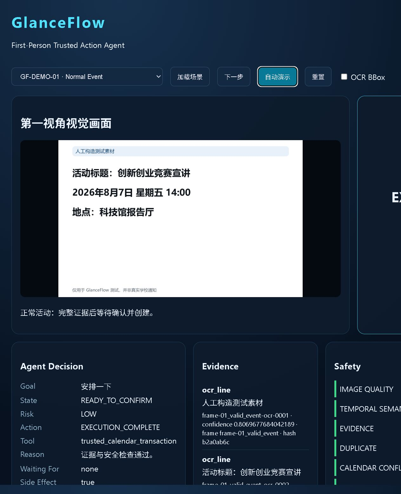
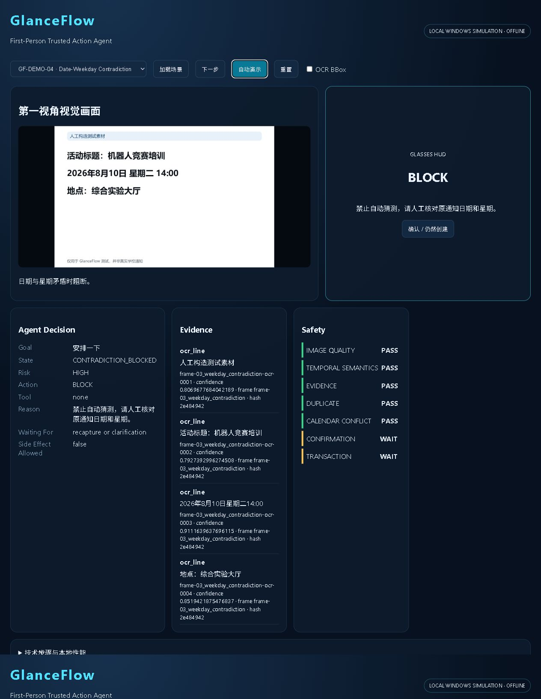
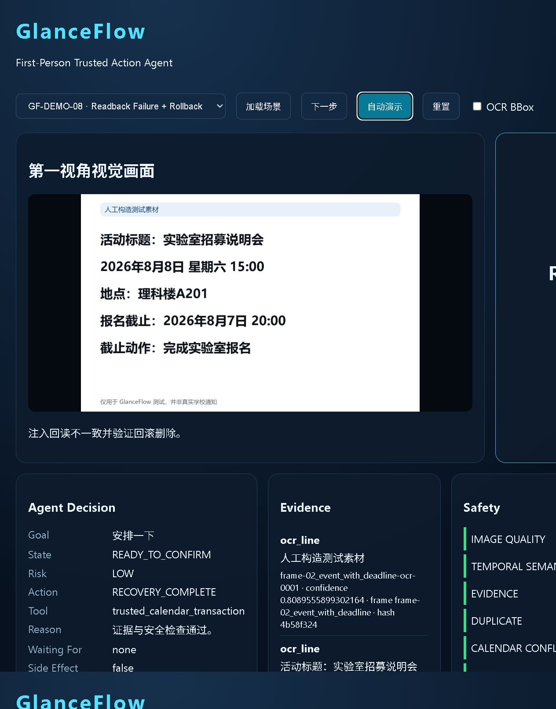

# 见程 GlanceFlow

> 面向校园高价值时限通知的第一视角可信行动 Agent，将现实世界视觉信息转化为有证据、可确认、可验证、可恢复的日程行动。

## 30 秒理解 GlanceFlow

用户看向一张通知并说“安排一下”。GlanceFlow 在本地完成图像质量检查、RapidOCR、字段级证据绑定和时间角色判断，再由 Risk-aware Agent 选择确认、澄清、重采、阻断或进入行动预检。只有证据、安全门、预检和用户确认全部满足时，可信事务层才写入隔离的 Memory Calendar，并在创建后按 `event_id` 回读验证；异常时回滚，用户也可精准撤销。

## 为什么不是 OCR + Calendar

OCR 能读到字符串，却不能可靠判断“报名截止”和“活动开始”是否属于同一个动作，也不能处理日期星期矛盾、日程冲突、确认后草案变化、写入超时、回读不一致或部分创建失败。直接把识别结果交给 Calendar API，会把感知错误升级为现实副作用。GlanceFlow 在“看见”与“执行”之间加入证据、语义、风险、确认和事务边界。

## 系统架构



完整图见 [final-architecture.md](docs/competition/final-architecture.md)。

## 四个核心创新

1. **Evidence-Bound Perception**：字段与 OCR 行、bbox、帧和图像 hash 绑定。
2. **Temporal Semantic Validation**：区分活动、截止、签到、发布、取消和改期等时间角色，并检测矛盾。
3. **Risk-Aware Action Agent**：根据证据和风险选择执行、确认、澄清、重采或阻断；决策轨迹只记录公开规则，不记录思维链。
4. **Trusted Action Transaction**：Action Preflight、结构化确认、幂等创建、回读验证、补偿回滚和精准撤销。

## Demo 截图

| 正常验证 | 日期矛盾阻断 | 安全回滚 |
|---|---|---|
|  |  |  |

## 快速启动（Windows）

```powershell
C:\x\python.exe -m venv .venv
.\.venv\Scripts\python.exe -m pip install -r requirements.txt
.\.venv\Scripts\python.exe -m pip install --editable .
powershell -ExecutionPolicy Bypass -File scripts\run_competition_demo.ps1
```

重置演示：

```powershell
powershell -ExecutionPolicy Bypass -File scripts\reset_competition_demo.ps1
```

## 八个 Demo 场景

| 场景 | 行为 |
|---|---|
| GF-DEMO-01 | 正常活动确认、创建、回读验证 |
| GF-DEMO-02 | 活动与报名截止分角色、双事件原子创建 |
| GF-DEMO-03 | 低质量图像请求重采，零事件 |
| GF-DEMO-04 | 日期星期矛盾阻断，零事件 |
| GF-DEMO-05 | 日程冲突要求明确加强确认 |
| GF-DEMO-06 | 按 transaction/event ID 精准撤销 |
| GF-DEMO-07 | 重复通知由行动预检阻断 |
| GF-DEMO-08 | 回读不一致后回滚并验证删除 |

## 实验结果

- Stage 5：46 个固定种子合成样本；完整指标见 `outputs/evaluation/`。
- Stage 7：相同 20 个本地合成/故障注入场景中，Direct 错误执行 11/20、Existing Pipeline 1/20、Optimized Agent 0/20。该小样本结果不表示绝对安全。
- Stage 14：8 个本地 Demo 场景；6 个核心场景各运行 10 次。在 60 次 **SIMULATOR REPEATABILITY TEST** 中未观察到错误副作用、重复事件、未清理事务或 crash。
- 所有耗时来自 Windows 本地 CPU，不代表实体眼镜性能。

详见 [final-metrics.md](docs/competition/final-metrics.md)。

## 项目结构

- `src/glanceflow/`：OCR、证据、时间语义、Agent、安全门、日历事务、设备边界和 Demo 控制器。
- `demo/scenarios/`：8 个固定、可重复运行的比赛场景配置。
- `evaluation/`：合成评测、对比实验、真实数据门禁与用户研究模板。
- `outputs/`：程序生成的评测、重复性测试、延迟和截图。
- `docs/competition/`：最终架构、指标、三分钟脚本、PPT 大纲与评委问答。
- `scripts/`：演示启动、重置、最终自检和交付包构建。

## 开源参考

设备边界设计参考 GlassKit，OCR 接口研究参考 PaddleOCR；未复制参考项目实现。依赖与来源边界见 [NOTICE-THIRD-PARTY.md](NOTICE-THIRD-PARTY.md)。

<!-- glanceflow-project-status:start -->
## 当前项目状态（机器生成）

本状态块由 `project_status.json` 生成；锁文件和正式评测结果优先于历史交接记录。

- PUBLIC_WEB lock：`READY`
- PUBLIC_WEB 正式评测：`EXECUTED`，纳入 9，排除 6
- OCR usable：9/9 (100.0%)
- Full-field correct：0/9 (0.0%)
- SAFE_DEFERRED：7；SAFE_BLOCKED：2；WRONG_EXECUTION：0
- 真实校园数据：`NOT_EXECUTED`，样本 0
- 真人用户实验：`NOT_EXECUTED`，参与者 0
- 当前全量测试次数：不写入状态汇总；仅以本次实际测试输出单独报告。
- 状态检查：`python scripts/check_status_consistency.py`

PUBLIC_WEB 只能称为 **Public-Web Real-World Notification Set**，不是校园实拍或真人实验。
<!-- glanceflow-project-status:end -->

## 实现状态与限制

**IMPLEMENTED AND SIMULATED**

- Windows 本地第一视角仿真
- Fake/Local Device 与 DeviceBridge
- RapidOCR、Evidence Binding、Temporal Semantics
- Risk-aware Agent、Safety Gate、Action Preflight
- Memory Calendar、回读、回滚、撤销

**NOT YET VALIDATED**

- Rokid 实体设备
- 真实校园采集数据
- 真人用户研究
- 真实 Google Calendar 生产环境
- 真实眼镜端延迟

默认比赛 Demo 完全离线，不访问 Google API、网络 LLM、云 OCR 或真实个人日历。
