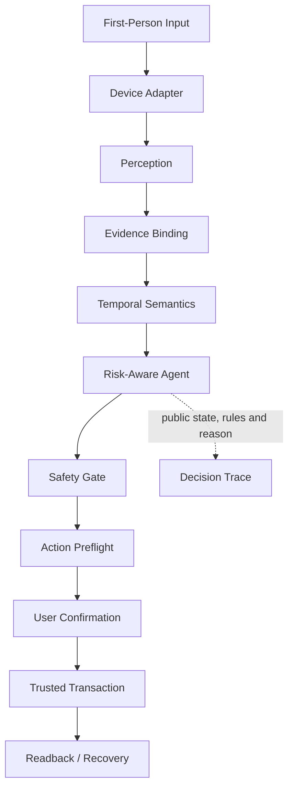

# GlanceFlow final architecture

The main chain is deliberately compact. Device adapters provide transport and capability boundaries, but never make temporal, Safety or Calendar decisions. The Decision Trace is a separate public audit artifact; it contains structured rules and reasons, not hidden chain-of-thought.

An export-ready vector is available at `docs/competition/final-architecture.svg`.
